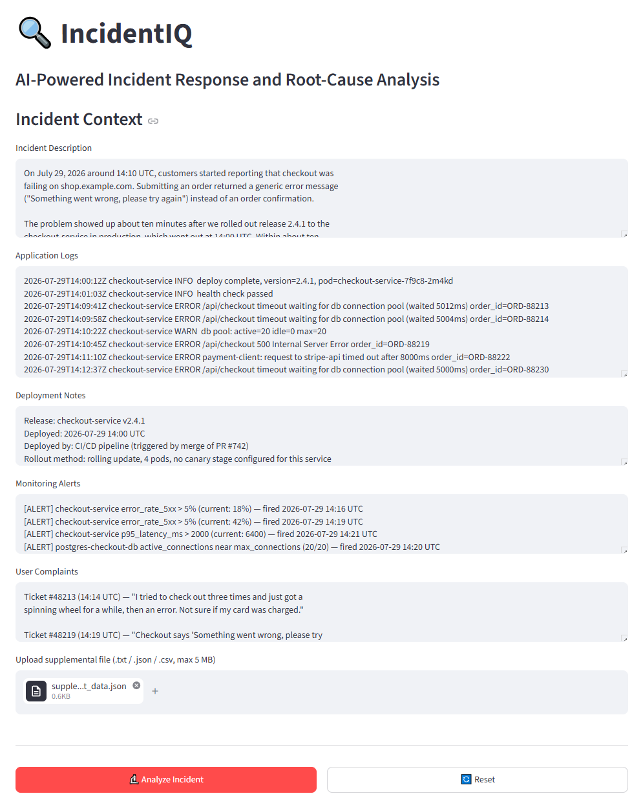
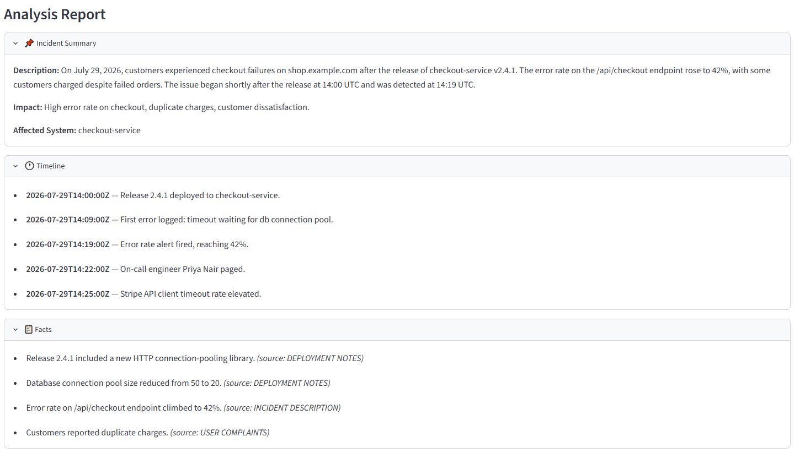
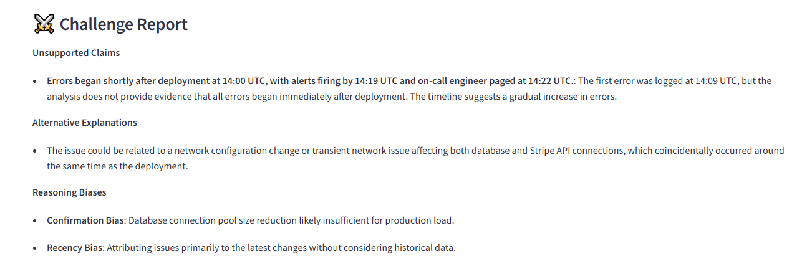
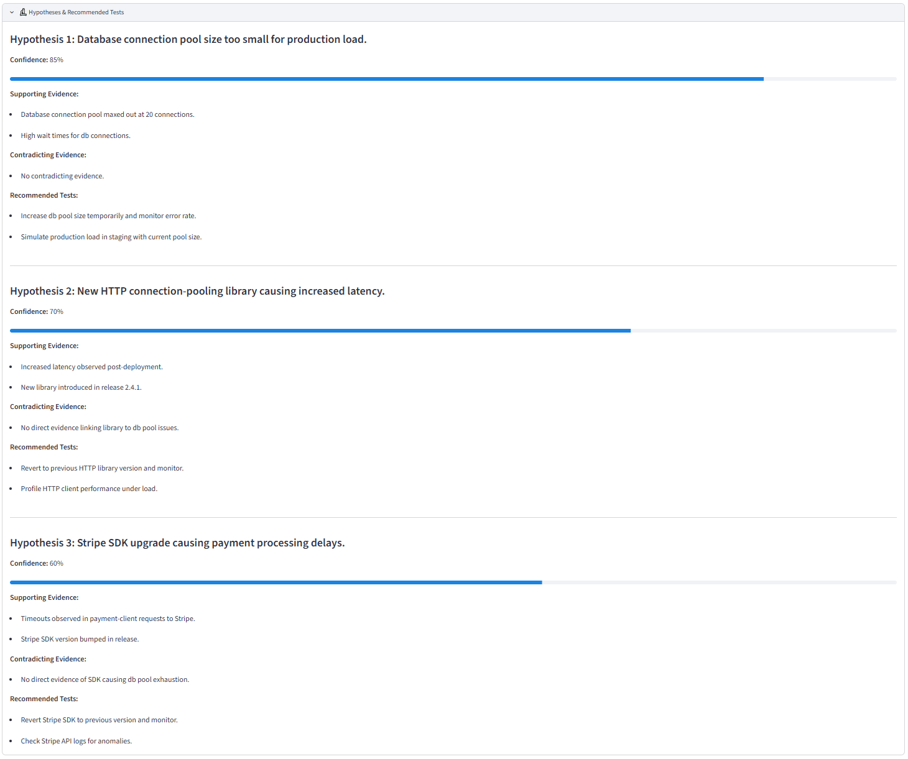
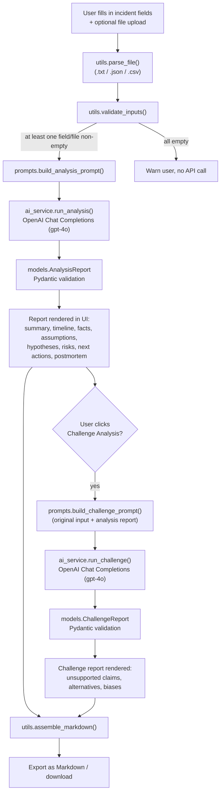

# IncidentIQ

AI-powered incident response and root-cause analysis assistant, built as a
single-page Streamlit application backed by the OpenAI API.

## Description

IncidentIQ takes the raw material of a production incident — a description,
application logs, deployment notes, monitoring alerts, user complaints, and an
optional supplemental file — and turns it into a structured analysis: a
timeline, a set of verifiable facts vs. assumptions, multiple root-cause
hypotheses with supporting/contradicting evidence, reasoning-risk callouts,
concrete next debugging steps, and a draft postmortem. A second **Challenge
Analysis** pass then critiques that report for unsupported claims,
alternative explanations, and reasoning biases.

## Purpose

Incident response is time-pressured and prone to tunnel vision: the first
plausible story often gets accepted without enough scrutiny. IncidentIQ is
meant to speed up the "what do we actually know, and what are we assuming"
part of an investigation, and to introduce a built-in second opinion that
pushes back on the first analysis before it hardens into the official
narrative.

## Main Features

- Five structured input fields: incident description, application logs,
  deployment notes, monitoring alerts, user complaints.
- Optional supplemental file upload (`.txt`, `.json`, `.csv`, up to 5 MB).
- One-click **Analyze Incident**, producing:
  - Incident summary, timeline, facts, and assumptions
  - At least three root-cause hypotheses, each with a confidence score,
    supporting/contradicting evidence, and recommended tests
  - Reasoning-risk callouts (cognitive biases in the analysis itself)
  - Prioritized next debugging actions
  - Unanswered questions
  - A draft postmortem (summary, timeline, root cause status, impact,
    resolution steps, lessons learned)
- **Challenge Analysis** — a second AI pass that critiques the first report:
  unsupported claims, alternative explanations, and reasoning biases.
- Export the full report (and challenge report, if generated) as a single
  Markdown file.
- Copy just the postmortem to the clipboard.
- All state lives in the browser session (`st.session_state`) — nothing is
  written to disk or persisted server-side.

## Screenshots

The following screenshots demonstrate the main workflow of IncidentIQ, from incident submission to AI-generated analysis and reasoning validation.

| Main Input | Analysis Report | Challenge Report |
|---|---|---|
|  |  |  |

### Root Cause Hypotheses

The AI generates multiple root cause hypotheses, each with supporting evidence, contradicting evidence, confidence assessment, and recommended validation steps.



## System Architecture Overview

IncidentIQ is a single-process Streamlit app with no database and no backend
service beyond the OpenAI API. [`app.py`](app.py) owns the UI and session
state; everything else is a plain, side-effect-free module it calls into:

- [`utils.py`](utils.py) — file parsing, input validation, Markdown assembly,
  postmortem text formatting. No Streamlit or OpenAI imports — fully unit
  testable in isolation.
- [`prompts.py`](prompts.py) — builds the system/user prompt pairs sent to
  OpenAI for both the analysis and challenge calls. Pure functions, no I/O.
- [`ai_service.py`](ai_service.py) — the only module that talks to the OpenAI
  API. Reads the API key, calls the Chat Completions API, and validates the
  JSON response against the Pydantic schema.
- [`models.py`](models.py) — Pydantic v2 models that define and enforce the
  exact shape of both AI-generated reports.

### AI Workflow



## Repository Structure

```
IncidentIQ/
├── app.py                       # Streamlit UI entry point (run this)
├── ai_service.py                # OpenAI API calls + response validation
├── models.py                    # Pydantic v2 schemas for both reports
├── prompts.py                   # System/user prompt construction
├── utils.py                     # File parsing, validation, Markdown export
├── requirements.txt             # Runtime + test dependencies
├── .env.example                 # Documents the OPENAI_API_KEY variable
├── .gitignore
├── README.md
├── tests/
│   ├── __init__.py
│   ├── test_ai_service.py       # API error-path tests (mocked client)
│   ├── test_models.py           # Pydantic validation tests
│   ├── test_properties.py       # Property-based tests (Hypothesis)
│   └── test_utils.py            # File parsing / markdown assembly tests
├── examples/
│   ├── README.md                # Guide to testing the app with sample data
│   ├── input/                   # Sample incident data (one consistent scenario)
│   │   ├── incident_description.txt
│   │   ├── application_logs.txt
│   │   ├── deployment_notes.txt
│   │   ├── monitoring_alerts.txt
│   │   ├── user_complaints.txt
│   │   ├── supplemental_incident_data.json
│   │   └── supplemental_logs.csv
│   └── output/
│       └── incident_analysis_example.md  # Real report exported from the app
└── .kiro/specs/incident-iq/     # Original design/requirements/task specs
```

## Technologies Used

- [Streamlit](https://streamlit.io/) — UI framework
- [OpenAI Python SDK](https://github.com/openai/openai-python) — `gpt-4o` via
  the Chat Completions API
- [Pydantic v2](https://docs.pydantic.dev/) — response schema validation
- [pytest](https://pytest.org/) + [Hypothesis](https://hypothesis.readthedocs.io/) — test suite

## Prerequisites

- Python 3.11+ (developed against 3.13)
- An OpenAI API key with access to `gpt-4o`
- Windows PowerShell (instructions below use PowerShell; adjust for macOS/Linux shells if needed)

## Installation

```bash
git clone <https://github.com/yairkr13/IncidentIQ.git>
cd IncidentIQ
```

### Virtual Environment Setup

```bash
python -m venv .venv
.venv\Scripts\Activate.ps1
```

### Dependency Installation

```bash
pip install -r requirements.txt
```

## OpenAI API Key Configuration (Windows PowerShell)

IncidentIQ reads the key from the `OPENAI_API_KEY` environment variable (see
`ai_service.get_api_key()`), falling back to Streamlit secrets
(`st.secrets["OPENAI_API_KEY"]`) if set. The app does **not** load `.env`
files automatically — `.env.example` is documentation only, showing the
variable name the app expects.

Set it for your current PowerShell session:

```powershell
$env:OPENAI_API_KEY = "sk-your-key-here"
```

Or persist it for your user account (requires a new terminal to take effect):

```powershell
[System.Environment]::SetEnvironmentVariable("OPENAI_API_KEY", "sk-your-key-here", "User")
```

Alternatively, create `.streamlit/secrets.toml` (already gitignored) with:

```toml
OPENAI_API_KEY = "sk-your-key-here"
```

> **Warning:** Never commit your real API key. Do not paste it into
> `.env.example`, `README.md`, source files, or any tracked file. `.env`,
> `.env.*`, and `.streamlit/secrets.toml` are excluded via `.gitignore`.
> If a key is ever committed by accident, treat it as compromised and
> rotate it immediately from your OpenAI account.

## Running the Application

```bash
streamlit run app.py
```

Streamlit will open the app in your browser (default: `http://localhost:8501`).
If `OPENAI_API_KEY` is not set, the interface still loads for exploration, but
the **Analyze Incident** and **Challenge Analysis** buttons stay disabled.

## Example Workflow

1. Set `OPENAI_API_KEY` (see above) and run `streamlit run app.py`.
2. Fill in one or more fields in the **Incident Context** panel, and/or upload
   a supplemental file. See [`examples/README.md`](examples/README.md) and
   [`examples/input/`](examples/input/) for ready-made sample data covering a
   full incident scenario.
3. Click **🔬 Analyze Incident** and wait for the report (up to 60 s).
4. Review the summary, timeline, facts, assumptions, hypotheses, reasoning
   risks, next debugging actions, unanswered questions, and draft postmortem.
5. Click **⚔️ Challenge Analysis** to get a critique of the report.
6. Click **⬇️ Export as Markdown** to download the full report, or
   **📋 Copy Postmortem** to copy just the postmortem to your clipboard.
7. Click **🔄 Reset** to clear all inputs and start over.

## Supported Input Types

- Free-text fields: Incident Description, Application Logs, Deployment Notes,
  Monitoring Alerts, User Complaints (up to 10,000–50,000 characters each).
- One supplemental file upload per analysis: `.txt`, `.json`, or `.csv`, up to
  5 MB. Flat JSON objects are flattened to `key: value` lines; nested JSON is
  pretty-printed; CSV rows are converted to `column: value` blocks.
- At least one field or a file must be non-empty to run an analysis.

## Generated Outputs

- **Analysis Report** — incident summary, timeline (with exact/inferred/unknown
  timestamps), facts (with source attribution), assumptions, three or more
  ranked hypotheses (confidence 0–100%, supporting/contradicting evidence,
  recommended tests), reasoning risks, next debugging actions, unanswered
  questions, and a six-section draft postmortem.
- **Challenge Report** (optional, on demand) — unsupported claims found in the
  analysis, alternative explanations not already covered, and reasoning biases
  tied to specific claims.

## Challenge Analysis

Challenge Analysis sends the original incident input together with the
generated analysis report to a second AI pass acting as a critical reviewer.
It looks for:

- **Unsupported claims** — statements in the analysis that aren't traceable
  back to the incident data provided.
- **Alternative explanations** — plausible root causes not already covered by
  the existing hypotheses.
- **Reasoning biases** — named cognitive biases or logical fallacies, each
  tied to the specific claim they apply to.

This is meant as a deliberate second opinion, not a rubber stamp — use it to
pressure-test the first report before treating it as the answer.

## Markdown Export

Clicking **⬇️ Export as Markdown** downloads a single `.md` file containing
the full analysis report (and the challenge report, if one has been
generated) via `utils.assemble_markdown()`. A real report generated from the
sample incident data is included at
[`examples/output/incident_analysis_example.md`](examples/output/incident_analysis_example.md).

## Known Limitations

- Single-turn analysis: there is no follow-up chat/refinement loop.
- No persistence — closing or refreshing the browser tab loses all input and
  results (`st.session_state` only, nothing written to disk).
- The model (`gpt-4o`, see `MODEL` in `app.py`) can hallucinate facts or
  misjudge confidence; **Challenge Analysis** helps but doesn't guarantee
  correctness — a human should still review before acting on it.
- Only one supplemental file can be uploaded per analysis.
- Requests time out after 60 seconds with no automatic retry.
- No authentication/authorization — anyone who can reach the running app can
  use your API key's quota.

## Privacy and Security Considerations

- All incident data you enter (logs, alerts, complaints, uploaded files) is
  sent to the OpenAI API for processing. Avoid pasting secrets, credentials,
  or customer PII unless you've reviewed your organization's data-handling
  policy for OpenAI API usage.
- Nothing is written to disk or a database by the app itself — all state is
  in-memory, per browser session.
- Keep `OPENAI_API_KEY` out of version control (see the warning above).
- If running this app somewhere reachable by others, put it behind your own
  authentication layer — IncidentIQ has none built in.

## Future Improvements

- Persist and browse past analyses (currently session-only).
- Support multiple supplemental file uploads per analysis.
- Add authentication for shared/hosted deployments.
- Allow model selection/configuration from the UI instead of a hardcoded
  constant.
- Add retry/backoff for transient OpenAI API errors.
- Add real screenshots and a demo video (see placeholders above/below).

## Troubleshooting

- **"Set OPENAI_API_KEY to enable analysis" banner won't go away** — confirm
  the environment variable is set in the *same* terminal session you launched
  `streamlit run app.py` from, then restart the app.
- **`Invalid API key` error** — the key was read but rejected by OpenAI;
  verify it's correct and has access to `gpt-4o`.
- **`Request timed out after 60 s.`** — the OpenAI API call exceeded the
  client timeout; try again, or check the OpenAI status page.
- **`Response was not valid JSON.` / Pydantic validation errors** — the model
  returned a response that didn't match the expected schema; retry the
  analysis. If it persists, check for an OpenAI API or model change.
- **File upload rejected** — only `.txt`, `.json`, and `.csv` are supported,
  and files must be under 5 MB and non-empty.
- **Port already in use** — run `streamlit run app.py --server.port 8502` (or
  any free port).

## Authors / Contributors

- Project maintained by [@Yair Krothamer](https://github.com/yairk) _(update with your
  preferred name/handle)_.

## Demo Video

> A demo video has not been recorded yet.

